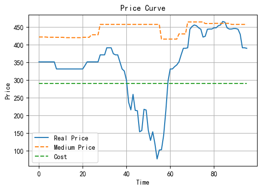
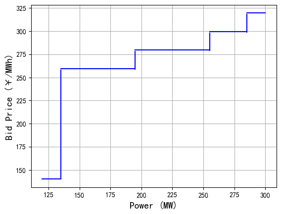

# Thermal Power Auto Bidding System

## 1. Rule Interpretation

### 1.1 Output Segment Constraints

- The starting point of the first bid must be the minimum technical output, and the endpoint of the last bid must be the rated capacity (mandatory requirement under Hubei market rules).
- Each bidding segment must satisfy:
  $$
  q_i \in \left[0.05 \cdot \text{Rated Capacity},\ 0.2 \cdot \text{Rated Capacity} \right]
  $$
- The total daily power generation must fall within a specific interval.

### 1.2 Price Segment Constraints

- Bidding prices must be **non-decreasing**.
- The price gap between segments must lie within: [20 RMB/MWh, 150 RMB/MWh].
- Certain segments can be assigned fixed prices.
- Weighted average price constraints can be applied.

---

## 2. Mathematical Model

### 2.1 Variable Definitions

- Price vector: $P$
- Output vector: $Q$
- Real-time market price: $P_{\text{real}, t}$

### 2.2 Objective Function

Only the single-deviation settlement market is considered, focusing on the revenue from mid/long-term contracts and real-time markets. The objective is to maximize gross generation profit:

$$
R = \sum_{t=1}^T (q_{i,t} - q_{\text{mid}}) \cdot (p_{\text{real},t} - C)
$$

Where $q_{\text{mid}}$ is the mid/long-term generation, and $q_{i,t}$ is the output of segment $i$ at time $t$.

---

### 2.3 Constraints

#### 2.3.1 Output Constraints

For $i = 0$:

$$
q_0 = \text{Min Technical Output} + 0.05 \cdot \text{Rated Capacity}
$$

For $i \geq 0$:

$$
q_{i+1} \geq q_i + 0.05 \cdot \text{Rated Capacity}
$$

$$
q_{i+1} \leq q_i + 0.20 \cdot \text{Rated Capacity}
$$

For $i = N$:

$$
q_N = \text{Rated Capacity}
$$

#### 2.3.2 Price Constraints

$$
20 \leq p_{i+1} - p_{i} \leq 150
$$

#### 2.3.3 Fixed Price for Specific Segment

Fix the price of segment $i$ as $P$:

$$
p_{i} = P \quad \forall i \in \{1, ..., N\}
$$

#### 2.3.4 Price Triggering Mechanism

Introduce 0-1 binary matrices `is[i, t]` and `real[i, t]`.

Using the Big-M method:

$$
P_{\text{real},t} - p_{i} \leq M \cdot \text{is}[i, t]
$$

$$
P_{\text{real},t} - p_{i} \geq -M \cdot (1 - \text{is}[i, t])
$$

Triggering decision for each output segment:

$$
\text{real}[i,t] = \text{is}[i,t] - \text{is}[i+1,t] \quad \forall i \in \{1, ..., N-1\}
$$

$$
\text{real}[N, t] = \text{is}[N, t]
$$

#### 2.3.5 Daily Generation Constraint

Power output at time $t$:

$$
\text{subQ}_t = \sum_{i=1}^{N} (p_{i} \cdot \text{real}[i, t])
$$

Total generation throughout the day:

$$
Q = \sum_{t=1}^T \text{subQ}_{t}
$$

Subject to:

$$
L \leq Q \leq R
$$

Where $[L, R]$ is the allowed daily output range.

#### 2.3.6 Weighted Average Price Constraint

$$
W_L \leq p_{1} (q_{1} - \text{MTO}) + \sum_{i=2}^{N} (q_{i} - q_{i-1}) \cdot p_i \leq W_R
$$

## 3. Numerical Experiments

Optimize scenario price and cost information.

  

#### 3.1  Bidding Output Example

Below is a sample output of the bidding scheme in table form:

| Unit_id  | Index | Left_Power | Right_Power | Bid_Price |
| -------- | ----- | ---------- | ----------- | --------- |
| ***a0003 | 1     | 120.0      | 135.0       | 140.000   |
| ***a0003 | 2     | 135.0      | 195.0       | 259.675   |
| ***a0003 | 3     | 195.0      | 255.0       | 279.675   |
| ***a0003 | 4     | 255.0      | 285.0       | 299.675   |
| ***a0003 | 5     | 285.0      | 300.0       | 319.675   |

#### 3.2 Price-Output Relationship

  

