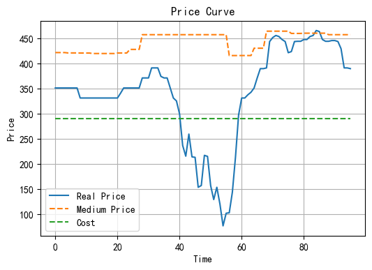
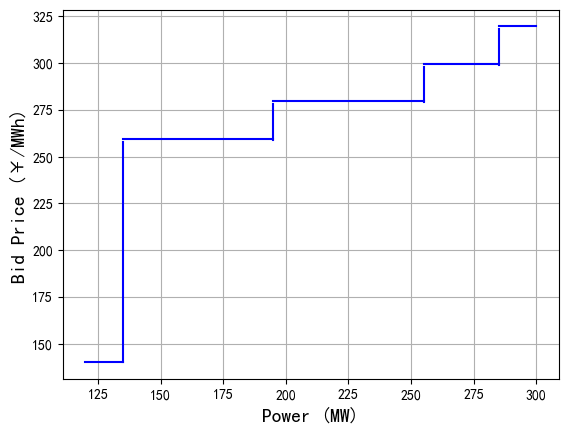

# 火电自动报价（Thermal Power Auto Bidding System）

## 1. 规则解读

### 1.1 出力段约束条件

- 第一个报价起点必须是最小出力，最后一个报价终点是额定功率（湖北交易规则强制要求）
- 每个报价段出力区间范围为：大于等于 `0.05 × 额定容量`，小于等于 `0.2 × 额定容量`，即：
  $$
  q_i \in \left[0.05 \cdot \text{额定容量},\ 0.2 \cdot \text{额定容量} \right]
  $$
- 限制全天发电量处于某个区间

### 1.2 价格区间约束条件

- 报价服从**单调非递减**
- 每段报价价差范围为：[20 元/MWh, 150 元/MWh]
- 支持指定某段报价为给定价格
- 考虑**加权均价约束**

---

## 2. 数学模型

### 2.1 变量定义

- 价格向量：$P$
- 出力向量：$Q$
- 真实市场价格：$P_{\text{real}, t}$

### 2.2 目标函数

仅考虑单偏差结算市场，即只考虑机组中长期收益和实时市场收益，以发电毛利收益为目标：

$$
R = \sum_{t=1}^T (q_{i,t} - q_{\text{mid}}) \cdot (p_{\text{real},t} - C)
$$

其中，$q_{\text{mid}}$ 是中长期发电量，$q_{i,t}$ 是在时段 $t$ 第 $i$ 段的出力。

---

### 2.3 约束条件

#### 2.3.1 出力约束

当 $i = 0$ 时：

$$
q_0 = \text{最小技术出力} + 0.05 \cdot \text{额定容量}
$$

当 $i \geq 0$ 时：

$$
q_{i+1} \geq q_i + 0.05 \cdot \text{额定容量}
$$

$$
q_{i+1} \leq q_i + 0.20 \cdot \text{额定容量}
$$

当 $i = N$ 时：

$$
q_N = \text{额定容量}
$$

#### 2.3.2 价格约束

$$
20 \leq p_{i+1} - p_i \leq 150
$$

#### 2.3.3 固定某段报价

指定第 $i$ 段报价为固定价格 $P$：

$$
p_i = P \quad \forall i \in \{1, ..., N\}
$$

#### 2.3.4 价格触发机制

引入二维矩阵 0-1 变量 `is_real_state[i, t]` 与 `real_choose[i, t]`：

大 M 法建模：

$$
P_{\text{real},t} - P_i \leq M \cdot \text{is\_real\_state}[i, t]
$$

$$
P_{\text{real},t} - P_i \geq -M \cdot (1 - \text{is\_real\_state}[i, t])
$$

进而判断是否触发该段出力：

$$
\text{real\_choose}[i,t] = \text{is\_real\_state}[i,t] - \text{is\_real\_state}[i+1,t] \quad \forall i \in \{1, ..., N-1\}
$$

$$
\text{real\_choose}[N, t] = \text{is\_real\_state}[N, t]
$$

#### 2.3.5 全天发电量约束

确定第 $t$ 时刻发电量：

$$
\text{sub\_q}_t = \sum_{i=1}^{N} (p_i \cdot \text{real\_choose}[i, t])
$$

全天总发电量：

$$
Q = \sum_{t=1}^T \text{sub\_q}_t
$$

满足约束：

$$
L \leq Q \leq R
$$

其中 $[L, R]$ 是全天出力的区间。

#### 2.3.6 加权均价约束

$$
W_L \leq p_1 (q_1 - \text{MTO}) + \sum_{i=2}^{N} (q_i - q_{i-1}) \cdot p_i \leq W_R
$$

---

## 3. 数值实验

优化场景价格和成本信息

### 3.1  报价方案

| Unit_id  | Index | Left_Power | Right_Power | Bid_Price |
| -------- | ----- | ---------- | ----------- | --------- |
| ***a0003 | 1     | 120.0      | 135.0       | 140.000   |
| ***a0003 | 2     | 135.0      | 195.0       | 259.675   |
| ***a0003 | 3     | 195.0      | 255.0       | 279.675   |
| ***a0003 | 4     | 255.0      | 285.0       | 299.675   |
| ***a0003 | 5     | 285.0      | 300.0       | 319.675   |

### 3.2 报价-出力函数关系图

